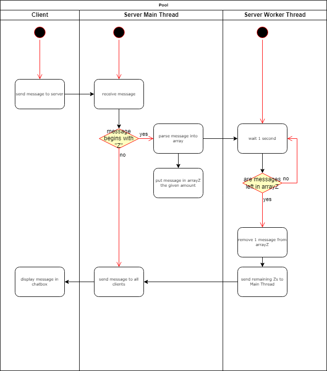

# GodotMultiThreading

# Files die mit dem Multithreading zu tun haben
- ZThreadController.gd
- messageParser.gd
- MultiplayerManager.gd
- ChatBox.gd 

# Ablauf
- Die Nachricht vom Client wird an den Server gesendet. Die kommt im MultiplayerManager in der Funktion "receive_dict" an. 
Da wird sie dann in der Funktion "checkMessage" überprüft, ob sie mit "Z" anfängt

- Falls "checkMessage" true zurück gibt, geht es weiter in die Funktion "send_message" im File ZThreadController.gd

- Die Funktion "send_message" fügt die Nachricht so oft wie angegeben in das Array "arrayZ" ein
- Der Worker-Thread im File messageParser.gd wird erstellt, sobald der Main-Thread erstellt wird. Dieser Worker-Thread arbeitet durchgehend.
- Er überprüft jede Sekunde, ob eine Nachricht im "arrayZ" ist, wenn ja, wird eine in diesem Array gelöscht. 
- Dann werden die Anzahl an verbleibenden Nachrichten an alle Clients gesendet.

# Ablaufdiagramm

